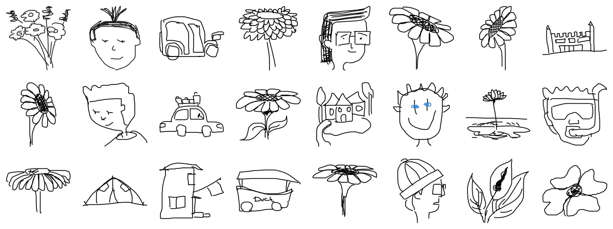

# 30 second art

A theme, a canvas, and about half a minute. Draw the thing before you have time
to talk yourself out of it.

[](https://bhaumikmistry.github.io/30-sec-art/)

**[See all 98 drawings →](https://bhaumikmistry.github.io/30-sec-art/)**
&nbsp;·&nbsp;
[By year](https://www.bhaumikmistry.com/projects/30-sec-art-grid)
&nbsp;·&nbsp;
[Draw one](https://www.bhaumikmistry.com/projects/30-sec-art)

## What is in here

Not pictures. Every drawing is kept as the strokes that made it, in the order
they were made, so it can be drawn again rather than only looked at. That is
why the gallery draws each one on as you scroll to it, and why a drawing can be
rendered at any size without going soft.

One file per drawing:

```json
{
  "id": "moutmdzl4un8",
  "artist": "some wild flower",
  "theme": "flower",
  "date": "2026-05-07T01:42:04.881Z",
  "strokes": [
    { "points": [{ "x": 211.3, "y": 149.1 }], "color": "#000", "width": 2 }
  ]
}
```

Points are in the 400x400 space of the canvas they were drawn on. The filename
is the id, which is a base36 timestamp, so the files sort by when they were
made.

Four themes so far: faces, flower, house, car.

## Adding one

Easiest is to [draw it on the site](https://www.bhaumikmistry.com/projects/30-sec-art).
That opens a pull request here for you.

By hand, add one `<id>.json` file at the root and open a pull request. A bot
comments on it with your drawing rendered, so you can see what landed before
anyone merges it. Do not edit `index.json`, `preview.svg` or `docs/` yourself,
because they are generated.

## Generated files

`build.mjs` reads every drawing and writes three things. It has no
dependencies, so it is a checkout and a `node build.mjs`:

| | |
|---|---|
| `index.json` | every drawing with its metadata, newest first |
| `preview.svg` | the contact sheet at the top of this page |
| `docs/index.html` | the gallery, one self-contained file, served by Pages |

A workflow runs it whenever a drawing file changes on `main` and commits the
result, so merging a drawing is all it takes to see it on the gallery.
